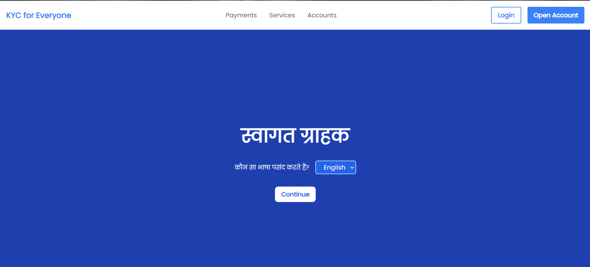
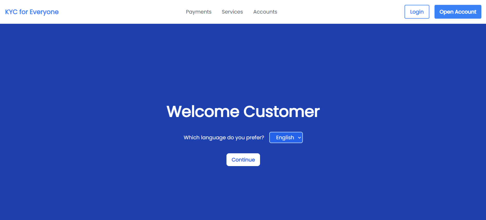
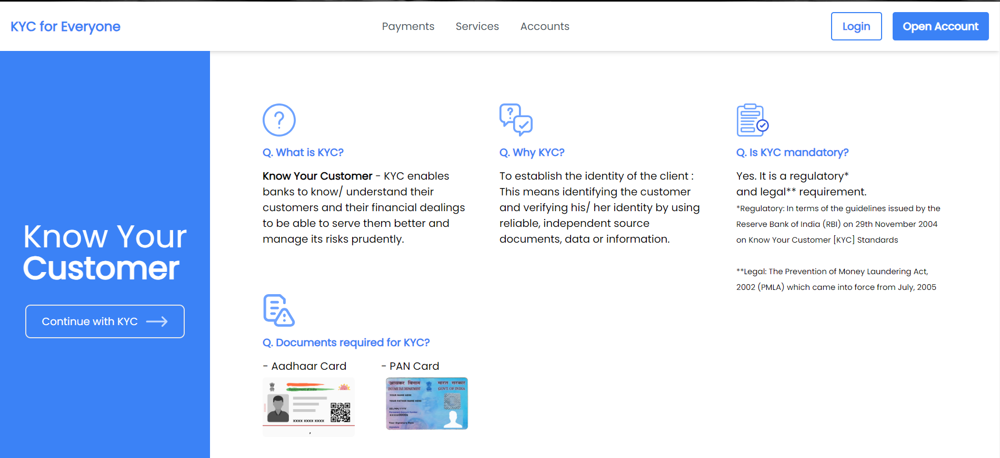
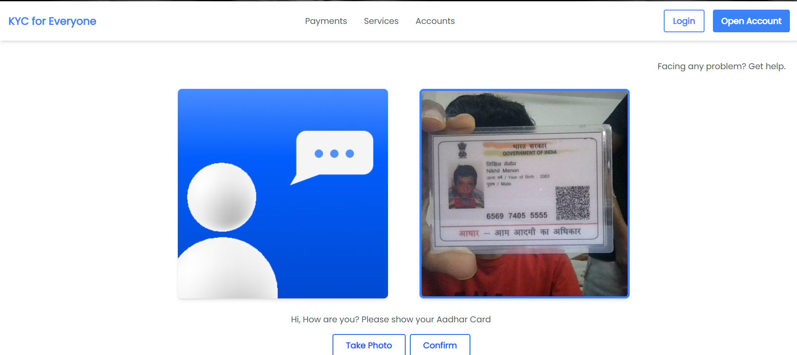
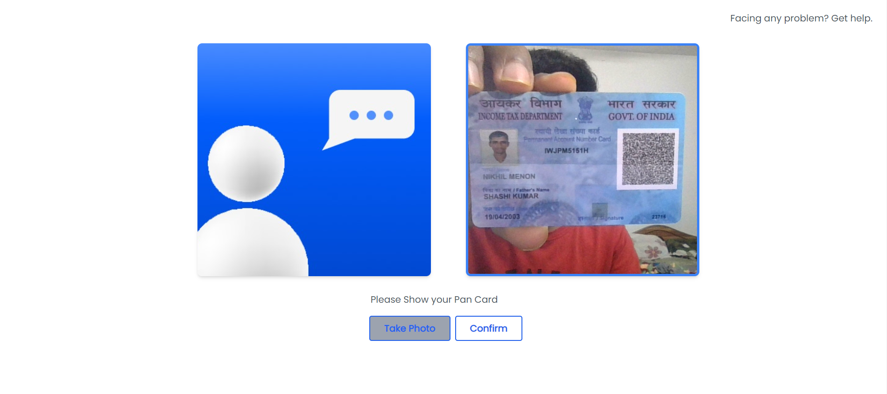
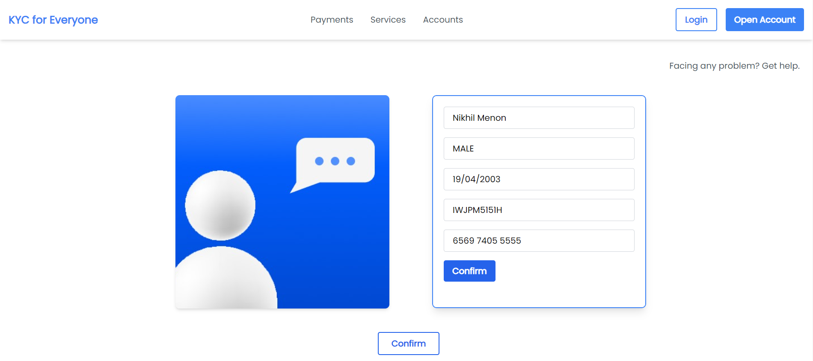
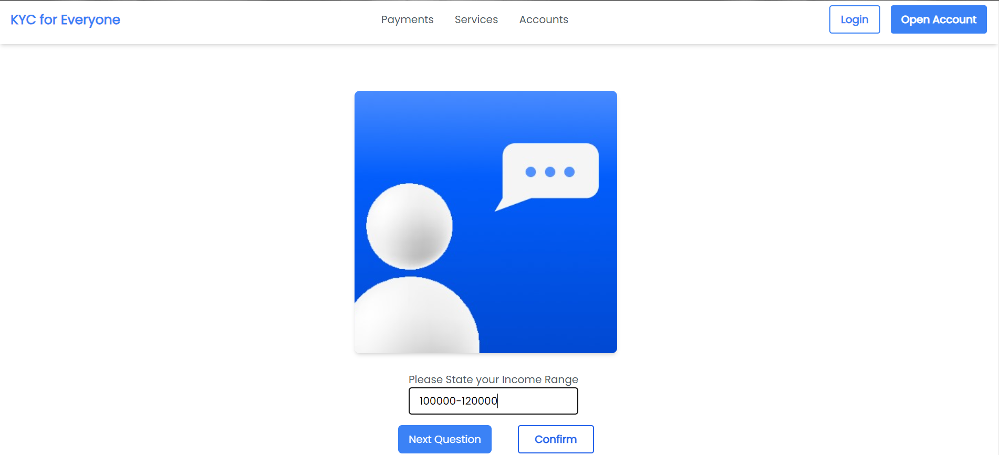
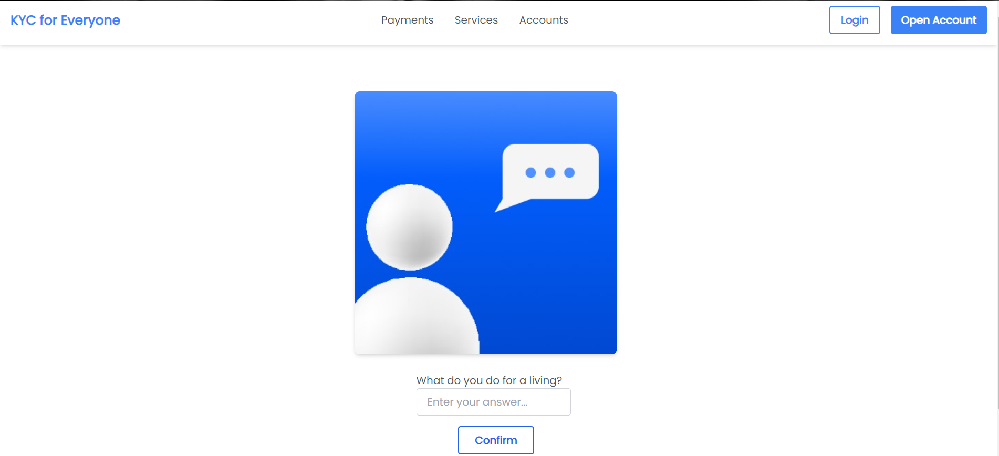
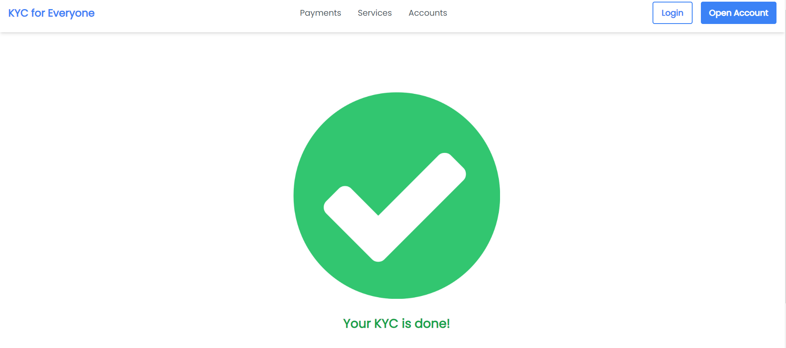

# Online Interactive Video KYC Platform

This repository contains the code for an online interactive video KYC (Know Your Customer) platform that simplifies the KYC process using modern technologies. The platform utilizes optical character recognition (OCR) to extract data from Aadhar cards and PAN cards, incorporates a voice assistant for a hands-free experience, and provides a user-friendly interface accessible to individuals with varying educational backgrounds.

## Why This Platform is Better

Traditional KYC methods often involve manual data entry, which can be time-consuming, error-prone, and challenging for individuals with limited literacy or technology skills. Our online interactive video KYC platform addresses these issues by leveraging advanced technologies:

- **OCR Integration**: The platform employs OCR to automatically extract basic User Information such as Name, DOB, PAN Number and Aadhar Number from the relevant Government Identities to eradicate any discrepancies, eliminating the need for manual data entry and reducing the risk of errors.

- **Multilingual Voice Assistant**: A built-in voice assistant enables users to interact with the platform using voice commands in their preferred language, making the process more accessible and inclusive for individuals who may have difficulty with typed inputs.

- **Speech Recognition**: The system allows users to converse verbally, removing the need for written answers, and is optimised to handle Indian accents.

- **User-Friendly Interface**: The platform's interface is designed to be intuitive and easy to navigate, ensuring a seamless experience for users with diverse educational backgrounds.

## Getting Started

To run the servers locally, follow these steps:

- **Clone this repository**:

  ```git clone https://github.com/bs6966/SC-Hack_TensionFlow.git```

- **Install the required dependencies**:

  ```sudo apt install tesseract-ocr```
  
  ```pip install -r requirements.txt```
  
  ```npm i```
  
- **Run the backend server**:

  ```python3 app.py```
  
- **In a separate terminal, navigate to the frontend directory and start the development server**:

  ```npm run start```

The frontend server should now be running at `http://localhost:3000`.

The backend server should now be running at `http://localhost:5000`.

## Screenshots and Demos

Here are some screenshots and demos showcasing the features and functionality of the online interactive video KYC platform:

### OCR Integration

The platform can extract information from Aadhar and PAN cards using OCR technology, eliminating the need for manual data entry.













### Voice Assistant

Users can interact with the platform using voice commands, thanks to the integrated voice assistant, making the process more accessible and inclusive.





### User-Friendly Interface

The platform's interface is designed to be intuitive and easy to navigate, ensuring a seamless experience for users with diverse educational backgrounds.

Feel free to explore the platform and provide feedback or report any issues you encounter.



## Future Scope

- **Signature Verification**: The platform uses Computer Vision to extract the signature from the Customer's PAN Card and verify it with a scanned copy to enable maximum security.

- **Face Verification**: For an extra layer of security, we plan on including a face verification system, where a snapshot of the Customer is taken and verified against the photograph in their identitites.
  
